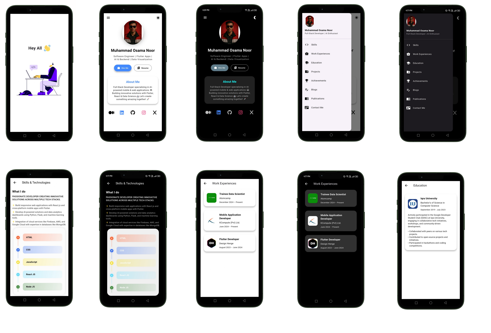
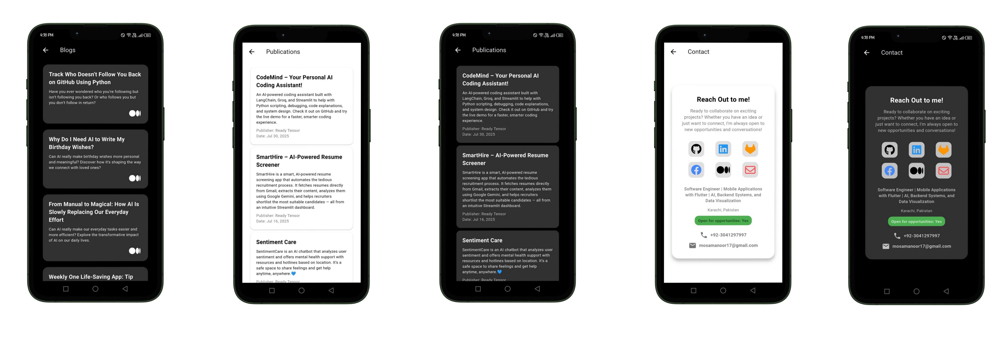

# flutterfolio ⚡️

A clean, beautiful, and responsive portfolio template for Software Developers built with Flutter!

## Table of Contents

- Features
- Portfolio Sections
- Getting Started
- How to Use
- Environment Setup
- Customization
- Deployment
- Technologies Used
- Contributors

---

## Features

- Responsive design for all screen sizes
- Beautiful gradient theme
- Modular data-driven architecture
- GetX navigation and feedback
- Clickable links (projects, socials, contact)
- Category-wise filtering for projects
- All assets and data managed in separate files

---

## Portfolio Sections

✔️ About Me  
✔️ Skills  
✔️ Education  
✔️ Work Experience  
✔️ Open Source Projects (GitHub)  
✔️ Big Projects  
✔️ Achievements & Certifications 🏆 
✔️ Blogs  
✔️ Publications  
✔️ Contact  
✔️ GitHub Profile

---

## Getting Started

These instructions will get you a copy of the project up and running on your local machine for development and testing purposes.

### Prerequisites

- Flutter (latest stable version)
- Git

---

## How to Use

```sh
# Clone this repository
git clone https://github.com/osamanoor17/Flutter-folio.git

# Go into the repository
cd flutterfolio

# Install dependencies
flutter pub get

# Add your .env file (see below)
```

---

## Environment Setup

Create a `.env` file in the root directory with the following variables:

```env
GITHUB_TOKEN=your_github_token_here
USE_GITHUB_DATA=true
GITHUB_USERNAME=your_github_username_here
```

> **Note:** Keep your tokens secret. Do not share or commit them.

---

## Customization

- All portfolio data is modularized in `lib/data/`
- Change theme, colors, and layout in `lib/`
- Add or update your resume, social links, and project details in the respective data files

---

## Deployment

You can build and deploy your portfolio for web or mobile:

```sh
# For Android
flutter build apk --release

# For iOS
flutter build ios
```

Host your web build on GitHub Pages, Netlify, or any static hosting provider.

---

## Technologies Used

- Flutter
- Dart
- GetX
- flutter_screenutil
- url_launcher

---

## Contributors

Feel free to open issues or pull requests to contribute and make this template even better!


### Interactive Demo

<p align="center">
	<iframe src="https://appetize.io/app/b_fzyibcpbaijgwt23k6adylqmxy" width="375" height="700" frameborder="0" scrolling="no"></iframe>
</p>


## Screenshots

Here are some screenshots of the app:

<p align="center">
	
	
	
</p>
